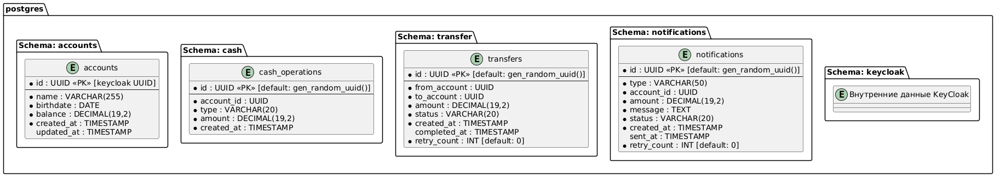
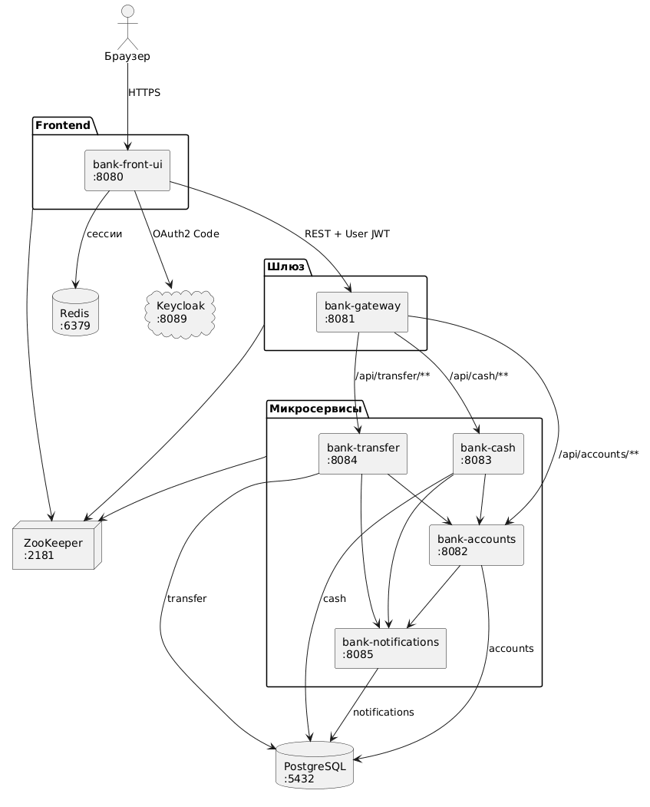

# Bank App

Учебный проект микросервисного банковского приложения для курса Яндекс.Практикума.
Позволяет использовать банковские аккаунты, управлять балансом (пополнение/снятие), выполнять переводы между пользователями и получать уведомления.

# Стек технологий
## Библиотеки, ЯП для реализации микросервисов
- Java 21,
- Spring Boot
- Spring Cloud Gateway
- Spring Data JDBC
- Spring Security (с использованием OAuth2 сервера Keycloak)
- Resilience4j
- Liquibase
- Thymeleaf
- Lombok
## Сторонние opensource сервисы
- Identity Provider: **Keycloak**
- БД: **PostgreSQL**
- БД для сессий: **Redis**
## Развертывание
- Docker, Docker Compose
- Kubernetes (KIND) + Helm
## Тесты
- Testcontainers
- JUnit 5
- Spring Cloud Contract
- WireMock


# Запуск (Docker Compose)

## Системные требования
Обязательное наличие Docker и Docker Compose.
## Запуск тестов

```
./mvnw verify
```

## Запуск всех сервисов

```
docker compose up --build -d
```

После запуска:
- Приложение доступно: http://localhost:8080
- Keycloak Admin: http://localhost:8089 (admin/admin)
- При первом запуске Keycloak импортирует realm из keycloak/realm-export.json
- Регистрация новых пользователей совершается на стороне keycloak (например, при помощи вставки администратором)
- В .env можно изменить большинство переменных среды.

## Остановка

```
docker compose down
```

Для удаления ещё и данных:

```
docker compose down -v
```

# Развертывание в Kubernetes (KIND + Helm)

## Системные требования
- Docker
- Kubernetes in Docker
- kubectl
- Helm 3

## Быстрый старт

```bash
# Разово: кластер + деплой + проброс портов
make cluster-up && make deploy && make port-forward
```

## Работа с Helm-чартами

### Установка всего приложения
```bash
helm dependency update ./helm/bank-app
helm upgrade --install bank-app ./helm/bank-app --namespace dev --create-namespace --wait
```

### Развертывание в разных средах
```bash
# Dev (по умолчанию)
helm upgrade --install bank-app ./helm/bank-app -n dev --create-namespace -f ./helm/bank-app/values-dev.yaml

# Test
helm upgrade --install bank-app ./helm/bank-app -n test --create-namespace -f ./helm/bank-app/values-test.yaml

# Prod
helm upgrade --install bank-app ./helm/bank-app -n prod --create-namespace -f ./helm/bank-app/values-prod.yaml
```

### Запуск тестов Helm-чартов
```bash
# Тесты всех сабчартов
helm test bank-app -n dev

# Тесты конкретного сабчарта
helm test bank-app -n dev --filter name=bank-app-postgres
```

### Удаление
```bash
make clean
```

## Структура Helm-чарта
```
helm/bank-app/
├── Chart.yaml - зависимости от сабчартов
├── values.yaml - значения по умолчанию (дев среда)
├── values-dev.yaml - значения для дев
├── values-test.yaml - test
├── values-prod.yaml - prod
├── templates/
│   ├── _helpers.tpl
│   └── ingress.yaml - Ingress для внешнего доступа
└── charts/
    ├── microservice-lib/ - Library chart
    ├── postgres/ - PostgreSQL (StatefulSet)
    ├── redis/ - Redis
    ├── keycloak/ - Keycloak
    ├── bank-gateway/ - API gateway
    ├── bank-accounts/
    ├── bank-cash/
    ├── bank-transfer/
    ├── bank-notifications/
    └── bank-front-ui/
```


Шаблоны всех 6 микросервисов вынесены в `microservice-lib`.
Каждый сабчарт содержит 3 файла: `Chart.yaml` с зависимостью от library, `values.yaml` с конфигурацией для конкретного микросервиса и `templates/all.yaml` для подключения шаблонов.
При добавлении нового микросервиса достаточно скопировать соседний сабчарт и изменить `values.yaml`, а также добавить в корневой values.yaml конфигурацию.

## Переменные окружения

### Docker Compose
- DB_HOST, DB_PORT, DB_NAME, DB_USERNAME, DB_PASSWORD - подключение к PostgreSQL.
- REDIS_HOST, REDIS_PORT - подключение к Redis.
- KEYCLOAK_HOST, KEYCLOAK_PORT, KEYCLOAK_REALM - координаты Keycloak.
- KEYCLOAK_EXTERNAL_URL - внешний URL Keycloak для браузера (redirect).
- IMPORT_DEMO_DATA - загрузка демо-данных в bank-accounts (true/false).

### Kubernetes / Helm
Конфигурация управляется через ConfigMaps и Secrets (см. `values.yaml`).
Чувствительные данные (пароли, client secrets) хранятся в Kubernetes Secrets.
Service Discovery реализован через Kubernetes DNS (ClusterIP Services).

# База данных


# Архитектура

## Схема взаимодействия
Микросервисы взаимодействуют с использованием Circuit Breaker, Distributed Logging...

Внутри микросервисы обычно используют OutboxScheduler.

Вся инфраструктура обернута в Docker.


# Модули и микросервисы

## bank-common

Общая библиотека, подключаемая всеми микросервисами как зависимость. Предоставляет:

- AccountsClient - WebClient для вызова bank-accounts (debit, credit, getAccount) с circuit breaker.
- NotificationClient - WebClient для вызова bank-notifications (send) с circuit breaker и безопасным fallback (логирует ошибку, не бросает исключение).
- CurrentUser - аннотация, которая позволяет извлекать accountId из JWT токена (sub).
- RequestIdFilter - генерация и пробрасывание traceId и spanId, запись для логгирования в MDC.
- WebClientAutoConfiguration - автоконфигурация WebClient с OAuth2 client credentials и пробросом трейсинг-заголовков.
- BankIntegrationTest, AbstractTestcontainersConfiguration (c PostgreSQL), CommonTestSecurityConfig (моки OAuth2), JwtTestUtils - для упрощения тестирования.

## bank-front-ui

Порт: 8080

Веб-приложение с серверным рендерингом на Thymeleaf.
Точка входа для пользователя.
Аутентификация через Keycloak. Страница авторизации в том числе в KeyCloak.
HTTP-сессии хранятся в Redis.

### Эндпоинты

- GET / - редирект на /account.
- GET /account - главная страница с данными аккаунта, балансом, интерфейсом для переводов.
- POST /account - обновление профиля (имя, дата рождения).
- POST /cash - пополнение или снятие денег.
- POST /transfer - перевод денег.

### Взаимодействие

Отправляет REST-запросы к bank-gateway.
Прикладывает User JWT в заголовке Authorization.
Каждый вызов защищён circuit breaker (accountsGateway, cashGateway, transferGateway).
В Kubernetes сервис обращается к gateway через DNS-имя Service.

## bank-gateway

Порт: 8081

API-шлюз на Spring Cloud Gateway. Единая точка входа для всех API-запросов.

### Маршруты
- к bank-notifications нет маппинга, т.к. не используется фронтом напрямую.
- /api/accounts/** -> http://bank-accounts
- /api/cash/** -> http://bank-cash
- /api/transfer/** -> http://bank-transfer

При недоступности кидает ошибку.
## bank-accounts

Порт: 8082

Управление банковскими аккаунтами и их балансами. Хранит профильную информацию пользователей и текущий баланс.

### Эндпоинты

- GET /api/accounts/me - получить свой аккаунт. Требует право: accounts:read. Если аккаунт не существует - создаётся автоматически.
- GET /api/accounts/{login} - получить аккаунт по ID. Требует право: accounts:read.
- PUT /api/accounts/me - обновить профиль (имя, дата рождения). Требует право: accounts:write. Валидация: возраст >= 18.
- GET /api/accounts/transfer-targets - список всех аккаунтов, кроме текущего (для выбора получателя перевода). Требует право: accounts:read.
- POST /api/accounts/{login}/debit - списание с баланса. Требует право: accounts:write. Ошибка 422 при недостаточном балансе.
- POST /api/accounts/{login}/credit - зачисление на баланс. Требует право: accounts:write.

## bank-cash

Порт: 8083

Денежные операции: пополнение и снятие.

### Эндпоинты

- POST /api/cash/deposit - пополнение счёта. Требует право: cash:operate.
- POST /api/cash/withdraw - снятие со счёта. Требует право: cash:operate.

## bank-transfer

Порт: 8084

Переводы денег между аккаунтами разных пользователей.

### Эндпоинты

- POST /api/transfer - выполнить перевод. Требует право: transfer:execute.
- GET /api/transfer/history - история переводов текущего пользователя. Требует право: transfer:read.

## bank-notifications

Порт: 8085

Сервис уведомлений. Принимает запросы на создание уведомлений от других сервисов.
В качестве отправки уведомлений используется... консоль).

### Эндпоинты

- POST /api/notifications - создать уведомление. Требует право: notifications:send.
